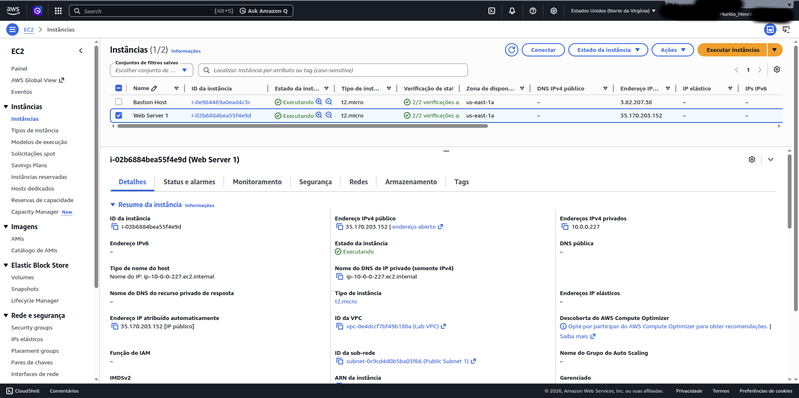
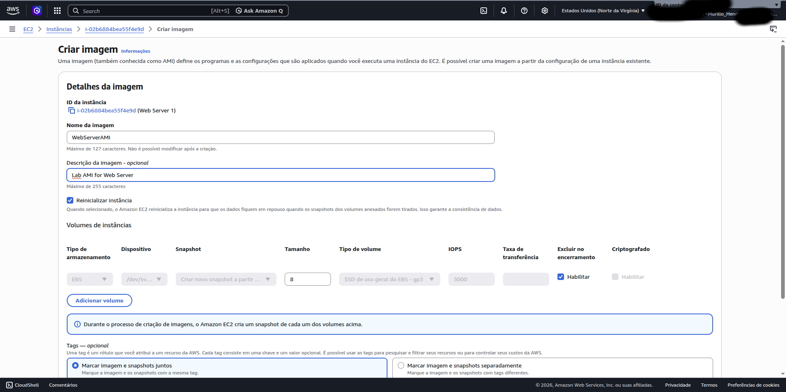
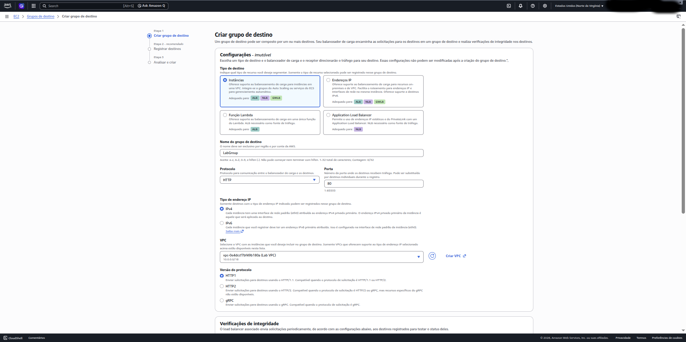
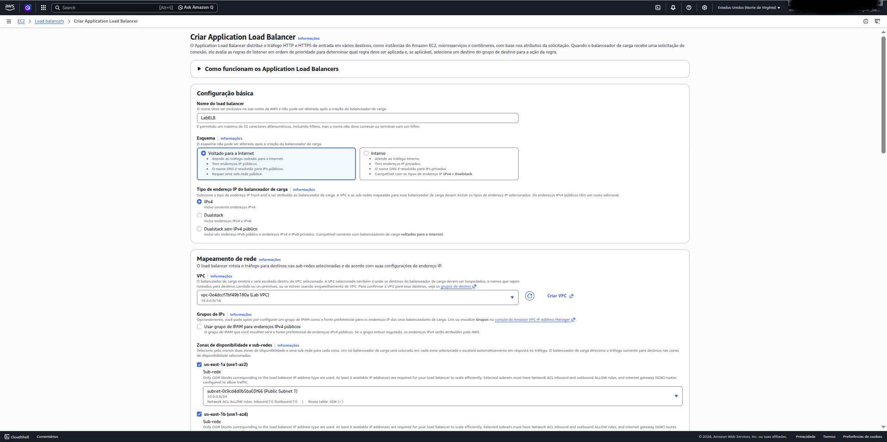
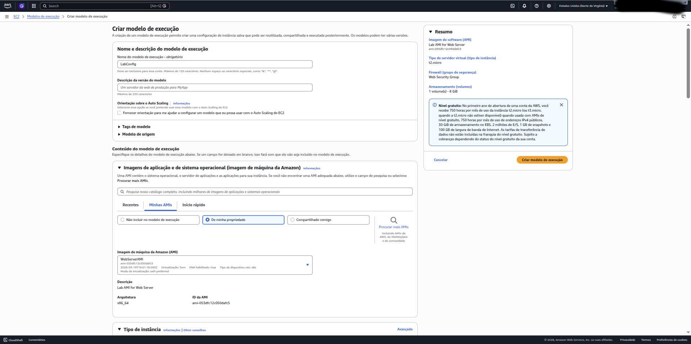
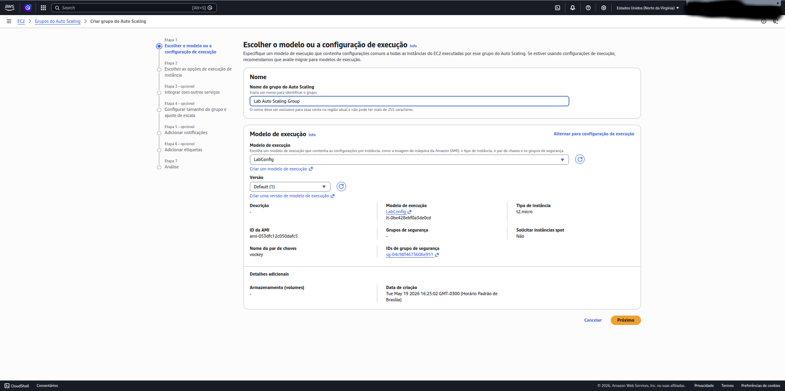
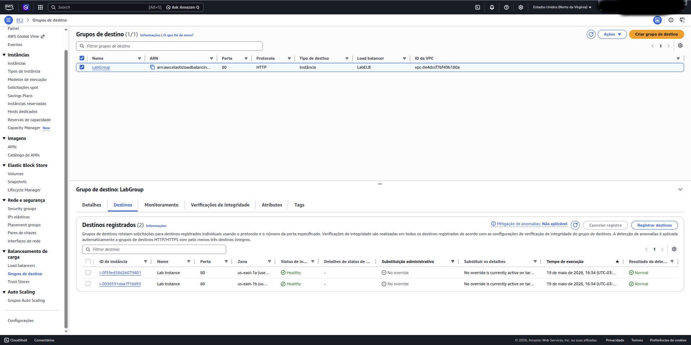
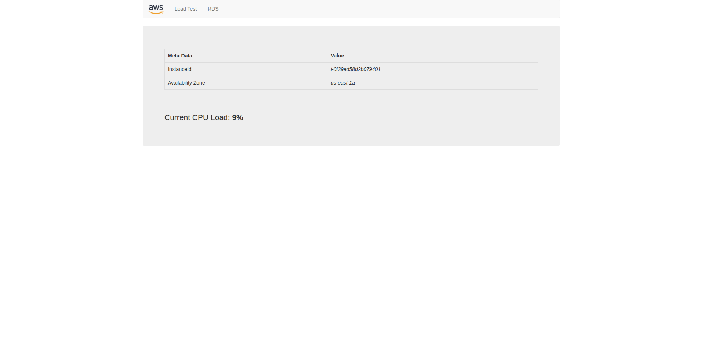
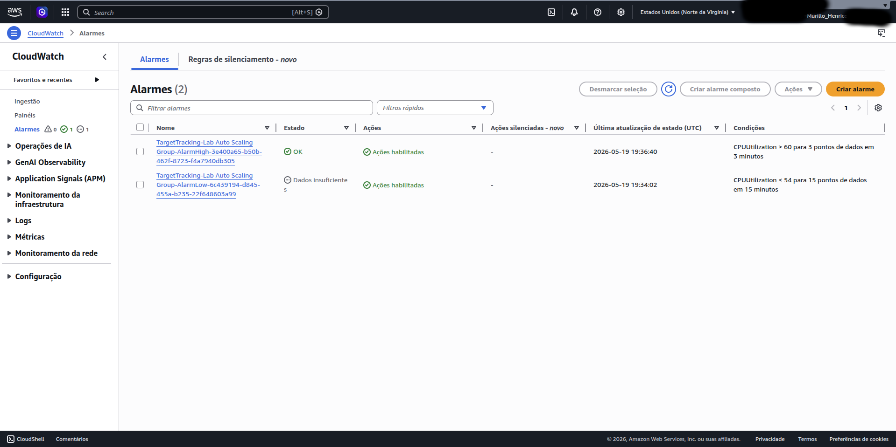
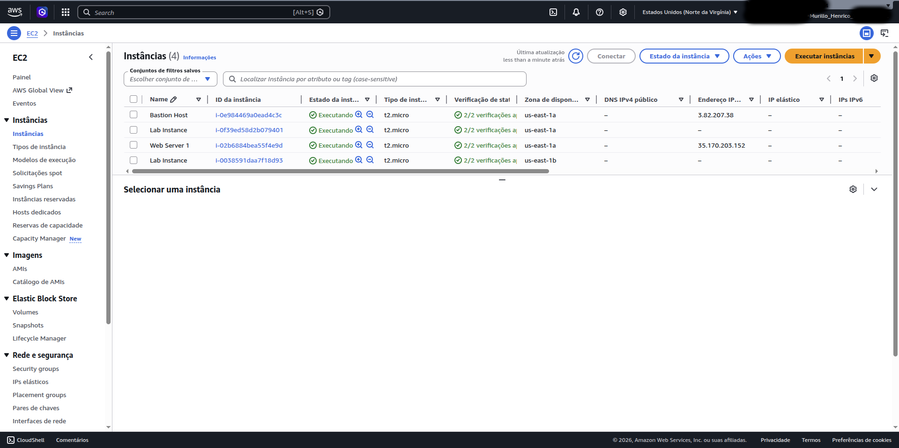

     

# AWS EC2 Auto Scaling & Load Balancer Lab

Hands-on AWS lab focused on building a scalable and highly available web application using Amazon EC2 Auto Scaling, Application Load Balancer, Launch Templates, and CloudWatch Alarms.

---

## Architecture Overview

The architecture spans two Availability Zones with public subnets hosting the Application Load Balancer and private subnets hosting the EC2 instances managed by the Auto Scaling Group.

---

## Objectives

This lab demonstrates how to:

- Create a custom AMI from an existing EC2 instance
- Configure a Target Group and Application Load Balancer
- Build a Launch Template for Auto Scaling
- Deploy an Auto Scaling Group across multiple Availability Zones
- Define scaling policies based on CPU utilization
- Monitor infrastructure with CloudWatch Alarms
- Validate load balancing and automatic scaling under load

---

## Technologies Used

- Amazon EC2
- Amazon Machine Images (AMI)
- EC2 Launch Templates
- EC2 Auto Scaling Groups
- Application Load Balancer (ALB)
- Target Groups
- AWS CloudWatch Alarms
- AWS VPC
- Security Groups

---

## Lab Steps

---

## Task 1: Create an AMI for Auto Scaling

A custom AMI was created from the existing `Web Server 1` EC2 instance to preserve the disk contents so that new instances can be launched with identical configurations.

### Steps Performed

- Selected the running `Web Server 1` instance
- Used **Actions > Image and templates > Create image**
- Named the image `WebServerAMI`

### Screenshot

---

## Task 2: Create a Load Balancer

### 2.1 Create a Target Group

A Target Group named `LabGroup` was created to define where the load balancer should send incoming traffic.

| Setting     | Value     |
|-------------|-----------|
| Target type | Instances |
| Name        | LabGroup  |
| VPC         | Lab VPC   |

### Screenshot

---

### 2.2 Create the Application Load Balancer

An internet-facing Application Load Balancer named `LabELB` was deployed across two public subnets.

| Setting          | Value                            |
|------------------|----------------------------------|
| Name             | LabELB                           |
| Scheme           | Internet-facing                  |
| VPC              | Lab VPC                          |
| Subnets          | Public Subnet 1, Public Subnet 2 |
| Security Group   | Web Security Group               |
| Listener         | HTTP:80 → forward to LabGroup    |

### Screenshots

.png)

---

## Task 3: Create a Launch Template and Auto Scaling Group

### 3.1 Launch Template

A Launch Template named `LabConfig` was created to define the EC2 configuration used by the Auto Scaling Group.

| Setting                    | Value                   |
|----------------------------|-------------------------|
| Name                       | LabConfig               |
| AMI                        | WebServerAMI (My AMIs)  |
| Instance type              | t2.micro                |
| Key pair                   | vockey                  |
| Security Group             | Web Security Group      |
| CloudWatch detailed monitoring | Enabled             |

### Screenshots

.png)

.png)

---

### 3.2 Auto Scaling Group

An Auto Scaling Group named `Lab Auto Scaling Group` was configured to launch instances into private subnets and integrate with the load balancer.

| Setting             | Value                                    |
|---------------------|------------------------------------------|
| Name                | Lab Auto Scaling Group                   |
| Launch Template     | LabConfig                                |
| VPC                 | Lab VPC                                  |
| Subnets             | Private Subnet 1, Private Subnet 2       |
| Load Balancer       | LabELB (attached via LabGroup)           |
| Desired capacity    | 2                                        |
| Minimum capacity    | 2                                        |
| Maximum capacity    | 6                                        |
| Scaling policy      | Target tracking — CPU avg at 60%         |
| Policy name         | LabScalingPolicy                         |
| CloudWatch metrics  | Enabled                                  |
| Instance tag        | Name: `Lab Instance`                     |

### Screenshots

.png)

.png)

.png)

.png)

---

## Task 4: Verify Load Balancing

### 4.1 Check Target Group Health

After the Auto Scaling Group launched the two `Lab Instance` instances, both were confirmed as **Healthy** within the `LabGroup` target group.

### Screenshot

---

### 4.2 Access the Application via Load Balancer

The application was accessed using the DNS name of `LabELB`, confirming that the load balancer successfully routed traffic to an EC2 instance.

### Screenshot

---

## Task 5: Test Auto Scaling

### Trigger Load Test

A load test was initiated from the web application interface by clicking **Load Test**. This caused all instances in the Auto Scaling Group to generate high CPU load simultaneously.

### CloudWatch Alarms

Two CloudWatch alarms were automatically created by the Auto Scaling policy:

| Alarm        | Trigger Condition    | Result                      |
|--------------|----------------------|-----------------------------|
| AlarmHigh    | CPU > 60% for 3 min  | Scale out (add instances)   |
| AlarmLow     | CPU < 60%            | Scale in (remove instances) |

As CPU utilization crossed the 60% threshold, `AlarmHigh` entered the **In alarm** state, triggering the Auto Scaling Group to launch additional instances beyond the initial two.

### Screenshots

---

## Auto Scaling Behavior Summary

| Phase          | Instance Count | Trigger                        |
|----------------|----------------|--------------------------------|
| Initial state  | 2              | Desired capacity = 2           |
| Under load     | 2 → up to 6    | AlarmHigh (CPU > 60%)          |
| After cooldown | Scales back in | AlarmLow (CPU returns to norm) |

---

## Key Takeaways

During this lab, the following concepts were practiced:

- Custom AMI creation from a running instance
- Application Load Balancer setup and Target Group configuration
- Launch Template best practices for Auto Scaling
- Multi-AZ deployment for fault tolerance
- Target tracking scaling policies
- CloudWatch Alarm integration with Auto Scaling
- Real-time scaling validation under load

---
