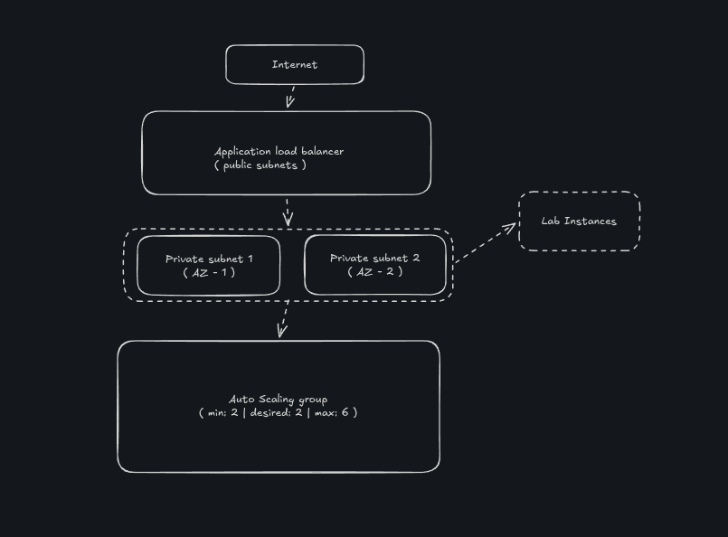

# Security Analysis — AWS EC2 Auto Scaling & Load Balancer Lab

## Overview

This document analyzes the security architecture and best practices implemented during the AWS Auto Scaling and Load Balancer lab.

The environment was designed to demonstrate scalable and highly available web application infrastructure while maintaining network isolation, controlled access, and monitoring through CloudWatch.

---

# Architecture Security Model

---

# Security Controls Implemented

## 1. Security Group Isolation

A dedicated Security Group (`Web Security Group`) was applied consistently across EC2 instances and the Application Load Balancer.

### Rules Implemented

| Resource              | Protocol | Port | Source    |
|-----------------------|----------|------|-----------|
| Application Load Balancer | HTTP | 80   | 0.0.0.0/0 (internet) |
| EC2 Instances         | HTTP     | 80   | Web Security Group (ALB only) |

### Security Benefits

- EC2 instances are not directly exposed to the internet
- Only traffic originating from the ALB reaches the instances
- Implements least privilege networking at the instance level
- Reduces attack surface on the compute layer

---

## 2. Private Subnet Placement for EC2 Instances

The Auto Scaling Group was configured to launch instances exclusively into private subnets.

### Configuration

| Setting | Value             |
|---------|-------------------|
| Subnet 1 | Private Subnet 1 |
| Subnet 2 | Private Subnet 2 |
| Public accessibility | No (instances) |

### Security Benefits

- Instances have no direct inbound route from the internet
- Egress traffic is controlled via routing tables and NAT
- Attack surface is limited to internal VPC communication
- Forces all public traffic through the load balancer

---

## 3. Application Load Balancer as a Security Perimeter

The ALB acts as the single entry point for all external traffic, providing an additional layer of security.

### Security Benefits

- Centralizes TLS termination (when HTTPS is configured)
- Shields backend instances from direct exposure
- Enables connection draining during instance replacement
- Supports WAF integration in production environments

---

## 4. Multi-AZ Deployment for Resilience

The Auto Scaling Group deployed instances across two Availability Zones.

### Availability Zones Used

| AZ    | Subnet           | Purpose              |
|-------|------------------|----------------------|
| AZ-1  | Private Subnet 1 | Primary instances    |
| AZ-2  | Private Subnet 2 | Redundant instances  |

### Security and Resilience Benefits

- No single point of failure at the infrastructure level
- Instances automatically replaced upon health check failure
- Maintains minimum capacity even during AZ-level disruptions
- Supports zero-downtime scaling operations

---

## 5. CloudWatch Monitoring and Alarming

Detailed CloudWatch monitoring was enabled at both the instance level and the Auto Scaling Group level.

### Monitoring Configured

| Feature                        | Scope                  | Interval  |
|--------------------------------|------------------------|-----------|
| EC2 Detailed Monitoring        | Individual instances   | 1 minute  |
| Auto Scaling Group Metrics     | Group-level aggregated | 1 minute  |
| CloudWatch Alarms (AlarmHigh)  | CPU > 60% → scale out  | Automated |
| CloudWatch Alarms (AlarmLow)   | CPU < 60% → scale in   | Automated |

### Security Benefits

- Rapid detection of abnormal resource consumption
- Automated response to load changes reduces manual intervention risk
- Audit trail of scaling events
- Foundation for anomaly detection in production environments

---

## 6. Launch Template as a Standardized Security Baseline

The `LabConfig` Launch Template enforces a consistent and controlled configuration for every new instance launched by the Auto Scaling Group.

### Configuration Enforced

| Setting                    | Value              |
|----------------------------|--------------------|
| AMI                        | WebServerAMI       |
| Instance type              | t2.micro           |
| Security Group             | Web Security Group |
| Key pair                   | vockey             |
| Detailed monitoring        | Enabled            |

### Security Benefits

- Prevents configuration drift between instances
- Guarantees that all instances use the approved AMI
- Ensures consistent security group assignment
- Simplifies auditing of compute configuration

---

# Potential Security Improvements

This lab intentionally simplified several configurations for speed and learning purposes. In real production environments, the following improvements should be applied.

---

## Enable HTTPS on the Load Balancer

The lab used HTTP on port 80.

### Production Recommendation

- Configure an HTTPS listener on port 443
- Attach an SSL/TLS certificate via AWS Certificate Manager (ACM)
- Redirect HTTP to HTTPS automatically
- Enforce TLS 1.2 or higher security policies

---

## Restrict SSH Access

The lab used a shared key pair (`vockey`) with no restrictions on SSH access.

### Production Recommendation

- Use AWS Systems Manager Session Manager instead of SSH
- Eliminate the need for a key pair entirely
- Remove inbound SSH (port 22) rules from all security groups
- Enforce IAM-based access control for instance sessions

---

## Enable Encryption at Rest

The lab used default EBS volumes without encryption.

### Production Recommendation

- Enable EBS encryption on all volumes via Launch Template
- Use AWS KMS Customer Managed Keys (CMK)
- Apply encryption to all AMI snapshots

---

## Implement Auto Scaling Notifications

The lab did not configure scaling event notifications.

### Production Recommendation

- Use Amazon SNS to notify teams of scale-out and scale-in events
- Integrate with PagerDuty, Slack, or other alerting platforms
- Log all lifecycle events to CloudWatch Logs

---

## Use IMDSv2 (Instance Metadata Service v2)

The lab did not explicitly enforce IMDSv2.

### Production Recommendation

- Enforce IMDSv2 in the Launch Template to prevent SSRF-based metadata attacks
- Disable IMDSv1 across all instance profiles

---

# Attack Surface Analysis

## Exposed Components

| Component                 | Exposure  | Notes                                   |
|---------------------------|-----------|------------------------------------------|
| Application Load Balancer | Public    | Intentional — single public entry point |
| EC2 Instances             | Private   | Accessible only through ALB             |

---

## Protected Components

The compute layer is protected through:

- Private subnet placement (no public IP on instances)
- Security Group restricting inbound to ALB only
- CloudWatch monitoring for anomaly detection
- Auto Scaling health checks replacing unhealthy instances automatically

---

# Shared Responsibility Model

| AWS Responsibility             | Customer Responsibility               |
|--------------------------------|---------------------------------------|
| Physical infrastructure        | Security Group configuration          |
| Hypervisor and host OS         | AMI content and hardening             |
| Managed load balancer service  | HTTPS/TLS configuration               |
| Auto Scaling orchestration     | Scaling policy thresholds             |
| CloudWatch data collection     | Alarm definitions and response plans  |
| AZ-level redundancy            | Multi-AZ group configuration          |

---

# Security Concepts Learned

This lab demonstrates practical implementation of:

- Least privilege access through Security Groups
- Network segmentation using public/private subnet separation
- Infrastructure immutability via Launch Templates and AMIs
- Automated health and availability management
- Real-time monitoring and reactive scaling
- Defense-in-depth through layered network controls
- Centralized traffic management via Application Load Balancer

---
