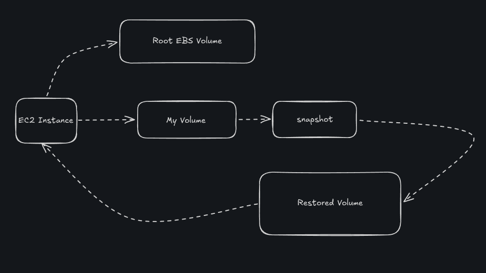
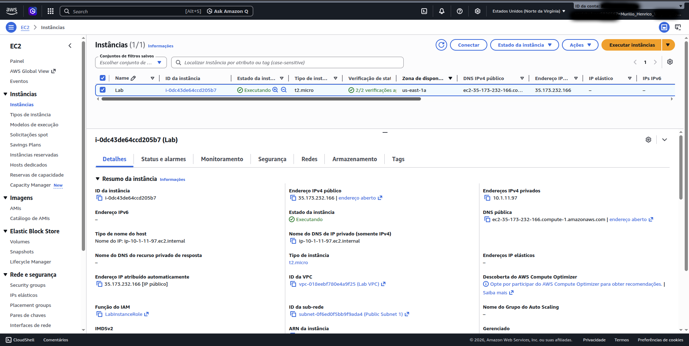
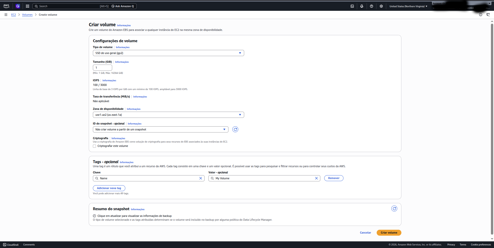
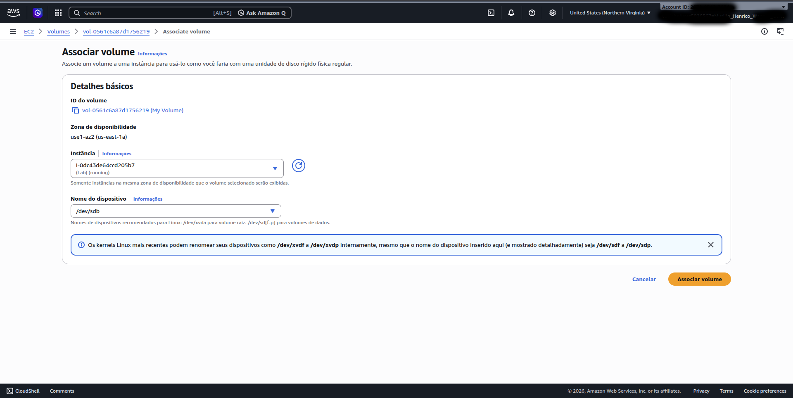
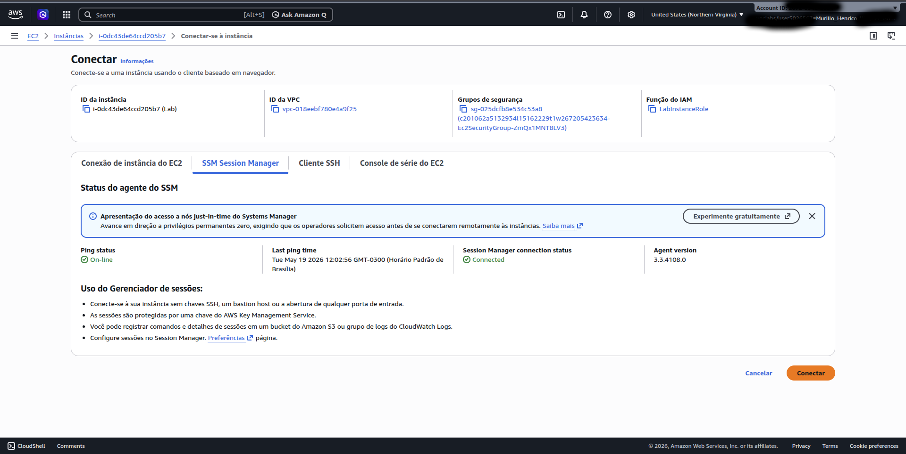
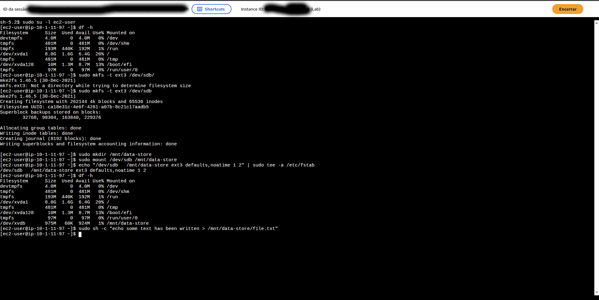
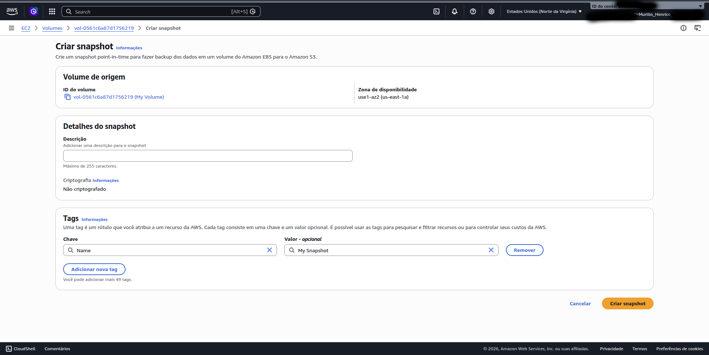
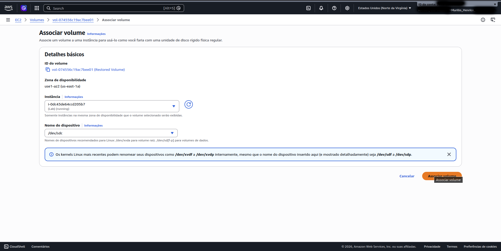
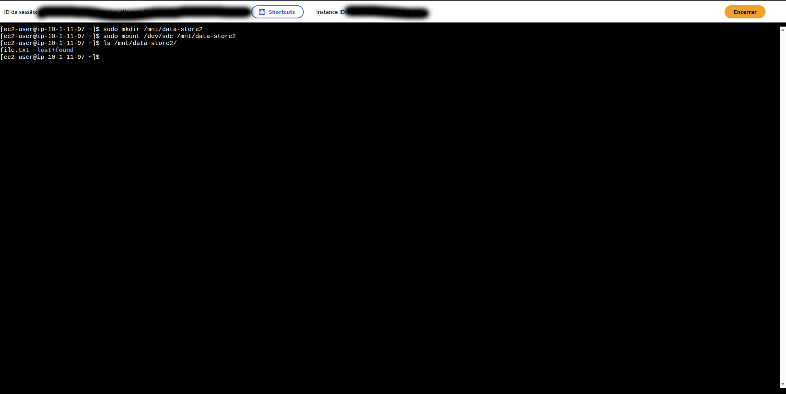

# AWS EBS Snapshot & Restore Lab

## Overview

This hands-on lab demonstrates how Amazon Elastic Block Store (EBS) works in practice by creating, attaching, mounting, snapshotting, and restoring EBS volumes on an Amazon EC2 instance.

The lab also explores Linux filesystem management, persistent mounts using `/etc/fstab`, and backup recovery using Amazon EBS Snapshots.

---

## Objectives

- Create and configure an Amazon EBS volume
- Attach EBS volumes to an EC2 instance
- Format and mount Linux file systems
- Configure persistent mounts with `/etc/fstab`
- Create Amazon EBS snapshots
- Restore data from snapshots
- Reattach restored volumes to EC2 instances

---

## Architecture



---

## Technologies Used

- Amazon EC2
- Amazon EBS
- Amazon EBS Snapshots
- AWS Systems Manager Session Manager
- Linux (Amazon Linux)
- ext3 File System

---

# Step-by-Step

---

## Step 1 — Create a New EBS Volume

A new 1 GiB General Purpose SSD (gp2) EBS volume was created in the same Availability Zone as the EC2 instance.

The volume was tagged as:

- Name: `My Volume`

### Instance Availability Zone



### Create Volume



---

## Step 2 — Attach the Volume to the EC2 Instance

The newly created EBS volume was attached to the running EC2 instance using the following device name:

```bash
/dev/sdb
```

### Attach Volume



---

## Step 3 — Connect to the EC2 Instance Using Session Manager

AWS Systems Manager Session Manager was used to connect securely to the EC2 instance directly from the AWS Console.

### Session Manager Connection



---

## Step 4 — Create and Configure the File System

The new EBS volume was formatted using the ext3 filesystem and mounted under:

```bash
/mnt/data-store
```

### Commands Executed

```bash
sudo mkfs -t ext3 /dev/sdb

sudo mkdir /mnt/data-store

sudo mount /dev/sdb /mnt/data-store
```

To make the mount persistent after reboot, the volume was added to `/etc/fstab`.

```bash
echo "/dev/sdb /mnt/data-store ext3 defaults,noatime 1 2" | sudo tee -a /etc/fstab
```

A test file was then created inside the mounted volume.

```bash
sudo sh -c "echo some text has been written > /mnt/data-store/file.txt"
```

### Terminal Commands



---

## Step 5 — Create an Amazon EBS Snapshot

A point-in-time snapshot was created from the EBS volume.

The snapshot was tagged as:

- Name: `My Snapshot`

This snapshot acts as a backup stored in Amazon S3-managed infrastructure.

### Create Snapshot



After the snapshot completed, the original file was deleted from the mounted volume.

### Delete Original File

```bash
sudo rm /mnt/data-store/file.txt
```

### Snapshot Terminal Commands

.png)

---

## Step 6 — Restore the Amazon EBS Snapshot

A new EBS volume was created from the snapshot and attached to the EC2 instance.

The restored volume was tagged as:

- Name: `Restored Volume`

### Attach Restored Volume



The restored volume was mounted under:

```bash
/mnt/data-store2
```

### Commands Executed

```bash
sudo mkdir /mnt/data-store2

sudo mount /dev/sdc /mnt/data-store2
```

The previously deleted file was successfully recovered from the snapshot-backed restored volume.

### Verify Restored File



---

# Key Learnings

During this lab, I learned:

- How Amazon EBS volumes work
- The importance of Availability Zones when attaching EBS volumes
- How Linux block device mounting works
- How to configure persistent mounts using `/etc/fstab`
- How Amazon EBS snapshots provide point-in-time backups
- How to restore deleted data using EBS snapshots
- The relationship between AWS storage services and Linux file systems

---

# Skills Demonstrated

- AWS EC2
- Amazon EBS
- Amazon EBS Snapshots
- Linux Storage Management
- File System Administration
- AWS Session Manager
- Cloud Infrastructure
- Backup & Restore Operations

---

# References

- AWS Documentation — Amazon EBS
- AWS Documentation — EC2
- AWS Systems Manager Documentation
