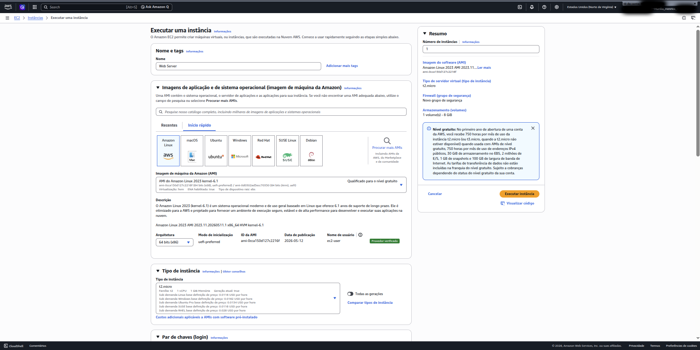
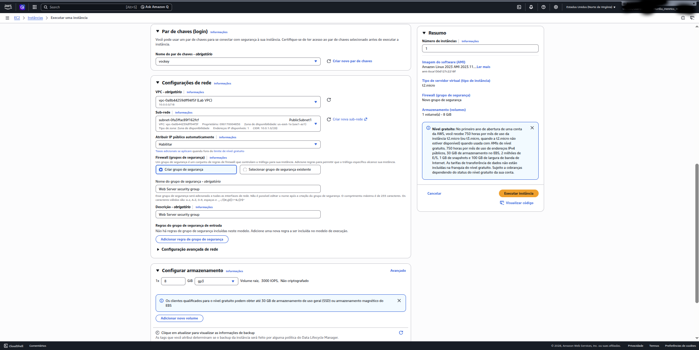
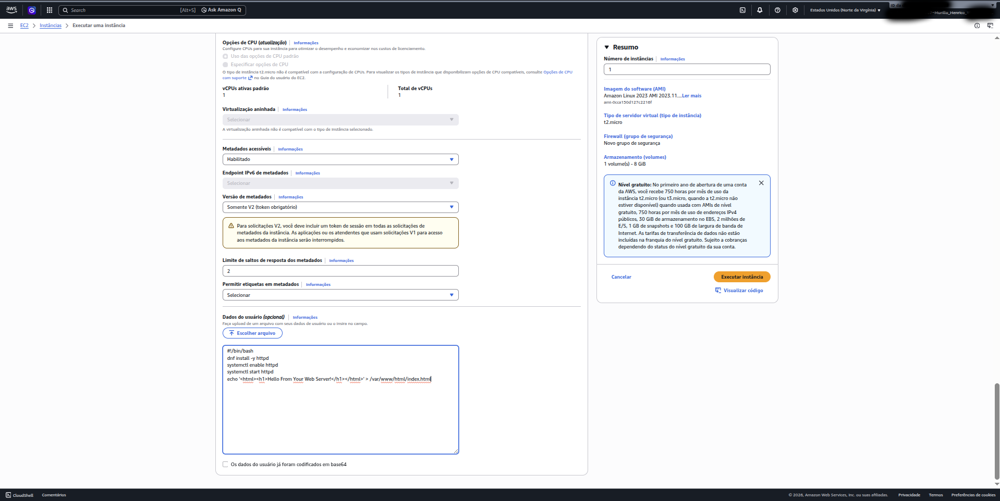
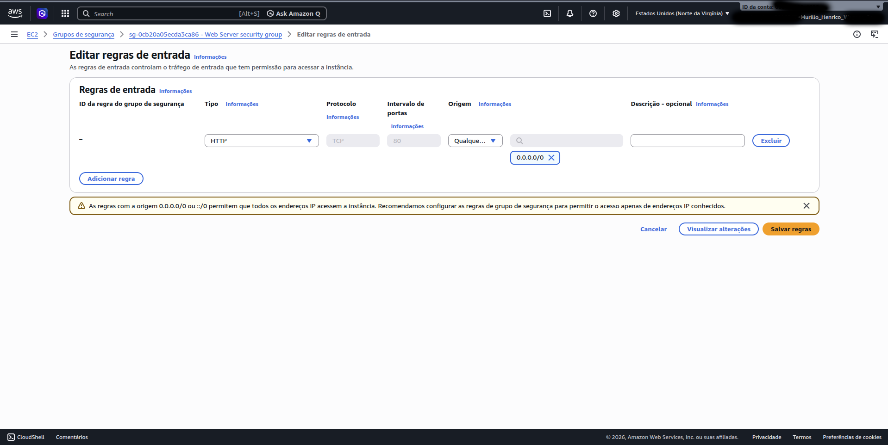
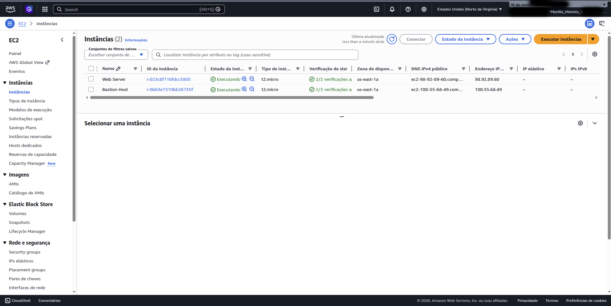
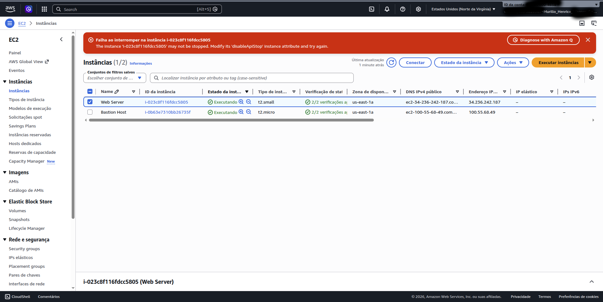
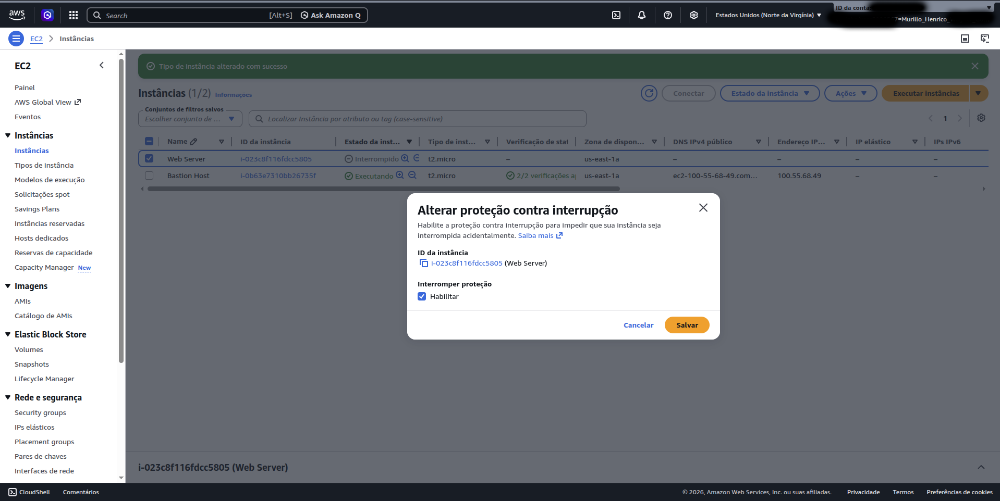
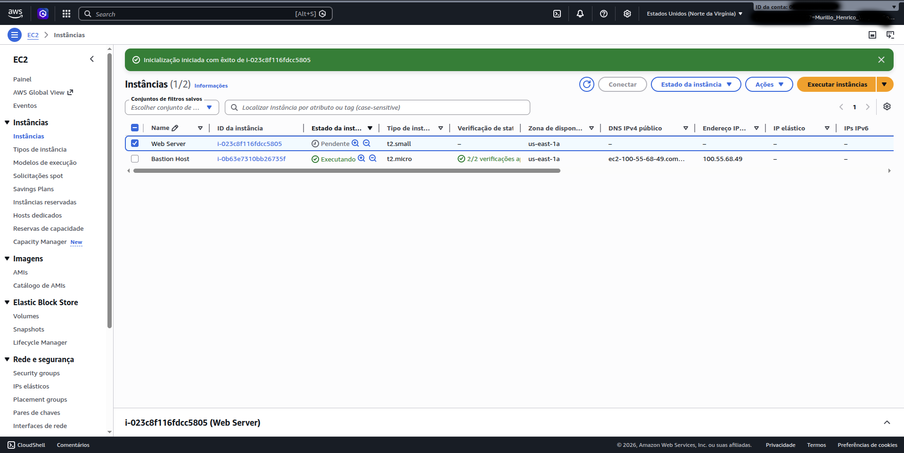
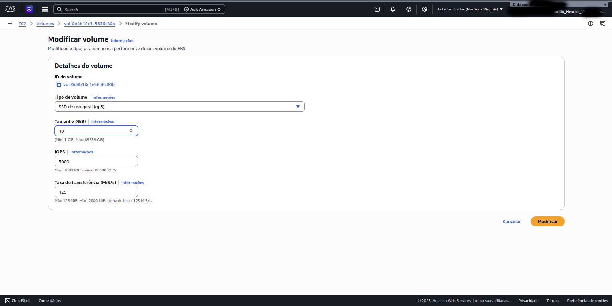

# AWS EC2 Hands-On Lab

Practical hands-on lab using Amazon EC2 on AWS Academy focused on:
- EC2 deployment
- Security Groups
- User Data automation
- Monitoring
- EBS resizing
- Instance protection
- Basic troubleshooting

---

# Technologies & Services

- Amazon EC2
- Amazon EBS
- Amazon CloudWatch
- Security Groups
- Amazon Linux 2023

---

# Skills Demonstrated

- EC2 instance deployment
- Linux web server provisioning
- Apache HTTP Server configuration
- Security Group management
- HTTP traffic configuration
- EC2 monitoring
- EBS volume resizing
- Instance type resizing
- Stop protection configuration
- AWS troubleshooting

---

# Task 1 — Launch EC2 Instance

An EC2 instance named `Web Server` was launched using Amazon Linux 2023.

## Configuration

| Setting | Value |
|---|---|
| Region | us-east-1 |
| Instance Type | t2.micro |
| AMI | Amazon Linux 2023 |
| Key Pair | vockey |
| VPC | Lab VPC |



---

## Security Group

A custom Security Group was created:

- Name: `Web Server security group`
- Initial inbound rules: none



This intentionally blocked inbound HTTP traffic.

---

## User Data Script

The following bootstrap script was used during instance launch:



```bash
#!/bin/bash
dnf install -y httpd
systemctl enable httpd
systemctl start httpd
echo '<html><h1>Hello From Your Web Server!</h1></html>' > /var/www/html/index.html
```

## Purpose

The script:
- installs Apache
- starts the service
- enables startup on boot
- creates a simple HTML page

---

# Task 2 — Monitor Your Instance

The EC2 instance was monitored using built-in AWS monitoring tools.

## Status Checks

The following checks were verified:

- System reachability
- Instance reachability

Both checks passed successfully.

---

## CloudWatch Metrics

The Monitoring tab was used to observe:
- CPU utilization
- Network traffic
- EC2 metrics

This demonstrated integration between EC2 and Amazon CloudWatch.

---

## System Logs

The instance system logs were accessed through:

```text
Actions → Monitor and troubleshoot → Get system log
```

The logs confirmed that the Apache HTTP package was installed successfully from the User Data script.

---

## Instance Screenshot

The EC2 screenshot feature was tested through:

```text
Actions → Monitor and troubleshoot → Get instance screenshot
```

This feature can help diagnose:
- boot issues
- unreachable instances
- graphical console problems

---

# Task 3 — Configure Security Group and Access Web Server

Initially, the web server could not be accessed from the browser.

## Cause

The Security Group contained no inbound HTTP rule.

As a result:
- port 80 traffic was blocked.

---

## Solution

An inbound HTTP rule was added:

| Type | Protocol | Port | Source |
|---|---|---|---|
| HTTP | TCP | 80 | 0.0.0.0/0 |

---

## Security Group Modification



---

## Result

After updating the Security Group rules, the web server became accessible from the browser.



---

# Task 4 — Resize Instance and EBS Volume

The EC2 instance was resized to simulate infrastructure scaling.

---

## Stop Instance

The instance was stopped before resizing operations.

### Instance Stop (t2.micro)


---

## Change Instance Type

The instance type was changed:

```text
t2.micro → t2.small
```

### Instance Resize Process


---

## Enable Stop Protection

Stop protection was enabled to prevent accidental shutdowns.

### Enable Stop Protection

.png)

---

## Stop Protection Error

When attempting to stop the protected instance, AWS blocked the action.



---

## Disable Stop Protection

Stop protection was then disabled.



---

## Stop Instance Successfully

The instance could then be stopped successfully.



---

## Resize EBS Volume

The root EBS volume was resized:

```text
8 GiB → 10 GiB
```

### Storage Resize



---

# Task 5 — Explore EC2 Limits

AWS Service Quotas were explored to understand EC2 limits.

The lab demonstrated:
- regional EC2 quotas
- On-Demand instance limitations
- service quota visibility

---

# Key Concepts Learned

## EC2
- Instance lifecycle
- Compute resizing
- User Data automation

## Monitoring
- CloudWatch metrics
- Status checks
- System logs

## Security
- Security Groups
- HTTP traffic filtering
- Inbound rules

## Storage
- EBS volumes
- Persistent storage
- Volume resizing

## Protection Mechanisms
- Stop protection
- Termination protection

---

# Final Notes

This lab provided practical exposure to core AWS infrastructure administration concepts using Amazon EC2.

The activities simulated real-world cloud administration tasks commonly performed by:
- Cloud Engineers
- DevOps Engineers
- Infrastructure Analysts
- Cloud Security Professionals
