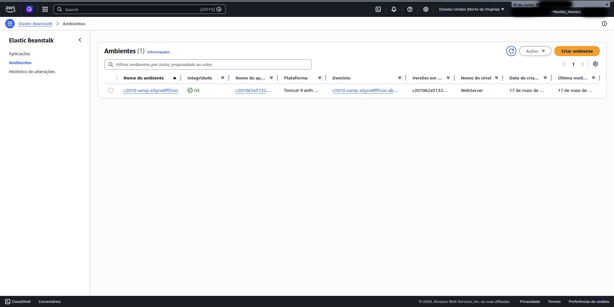
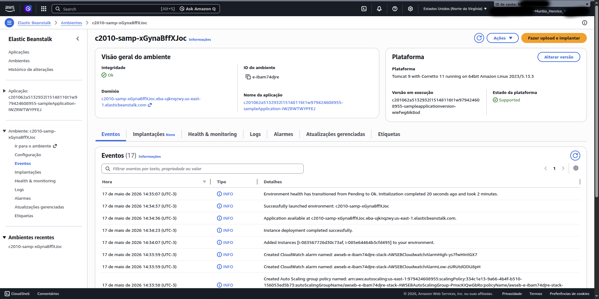
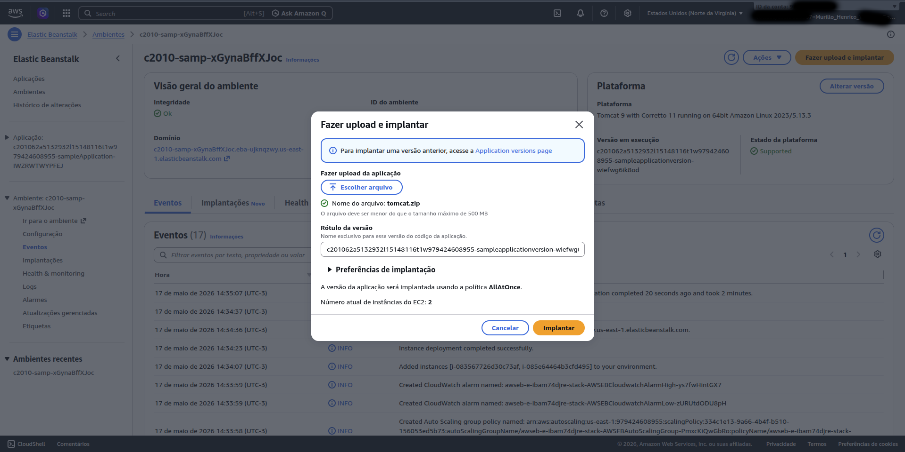
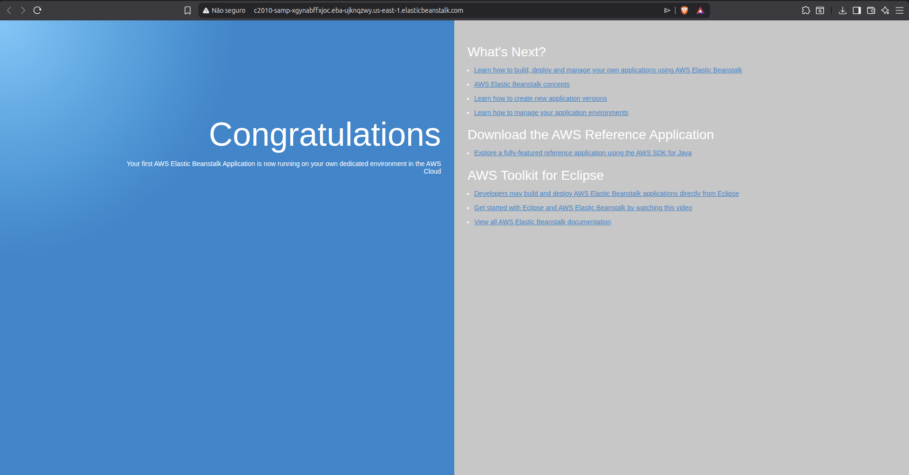
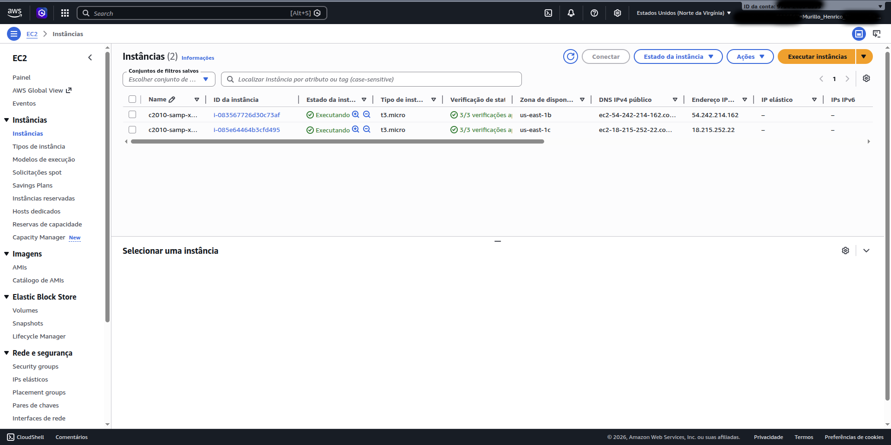
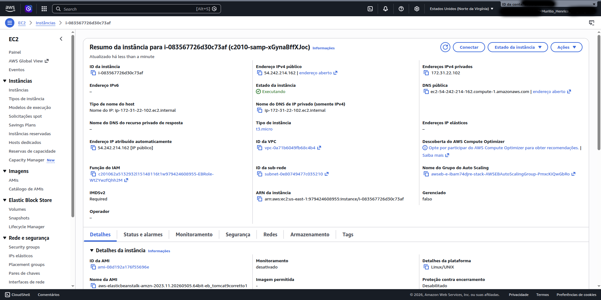

# AWS Elastic Beanstalk Lab

This repository documents a hands-on AWS Elastic Beanstalk lab focused on deploying and managing a web application using AWS managed services.

---

# Objective

The goal of this lab was to:

- Explore AWS Elastic Beanstalk
- Deploy a sample web application
- Understand how Elastic Beanstalk provisions infrastructure automatically
- Analyze the AWS resources created behind the scenes
- Explore monitoring and scaling capabilities

---

# AWS Services Used

- AWS Elastic Beanstalk
- Amazon EC2
- Elastic Load Balancer (ELB)
- Auto Scaling Group
- Security Groups
- CloudWatch Monitoring

---

# Architecture Overview

Elastic Beanstalk automatically provisioned:

- EC2 instances running the application
- Load balancer
- Auto Scaling Group
- Security Groups
- Monitoring resources

This demonstrates how Elastic Beanstalk simplifies application deployment and infrastructure management.

---

# Task 1 — Accessing the Elastic Beanstalk Environment

The Elastic Beanstalk environment was already provisioned and available in the AWS Console.

Initially, the environment health status was marked as **Ok**, indicating that the infrastructure was operational.

## Elastic Beanstalk Dashboard

---

# Initial Application Test

The environment domain URL was accessed before deploying any application.

Since no application was running yet, the server returned an HTTP 404 error.

This behavior is expected because the environment infrastructure exists, but no code had been deployed.

## HTTP 404 Response

---

# Task 2 — Deploying the Application

A sample Tomcat application provided by AWS was downloaded and deployed using the **Upload and Deploy** feature.

AWS sample application:

- https://docs.aws.amazon.com/elasticbeanstalk/latest/dg/samples/tomcat.zip

## Upload and Deploy Screen

---

# Selecting the Application Package

The `.zip` application package was uploaded to Elastic Beanstalk.

Elastic Beanstalk automatically handled:

- Deployment
- Environment update
- Instance provisioning
- Application hosting

## Choosing the ZIP File

---

# Application Successfully Running

After deployment completed, the application became accessible through the Elastic Beanstalk domain.

## Running Application

---

# Task 3 — Exploring AWS Resources

Elastic Beanstalk automatically created EC2 instances to host the application.

## EC2 Instances Running

---

# EC2 Instance Details

The created EC2 instances could be inspected directly from the EC2 Console.

It was possible to verify:

- Instance status
- Networking
- Monitoring
- Security groups
- Instance type

## EC2 Instance Summary

---

# Automatically Provisioned Resources

Elastic Beanstalk automatically created:

- EC2 instances
- Load balancer
- Auto Scaling Group
- Security Groups
- Monitoring resources

without requiring manual configuration.

---

# Final Considerations

This lab provided practical exposure to AWS managed application hosting and demonstrated how Elastic Beanstalk integrates multiple AWS services into a simplified deployment workflow.

Additionally, the lab highlighted important infrastructure and security concepts related to:

- Public application exposure
- Managed cloud environments
- Security groups
- Load balancing
- Auto Scaling
- Infrastructure abstraction

The lab also provided practical exposure to AWS managed services and their integration with EC2 infrastructure.

---
