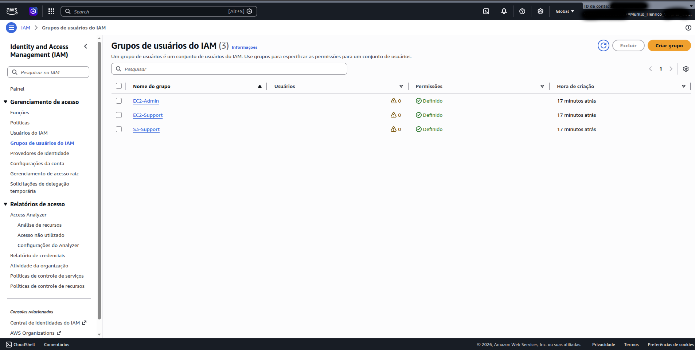
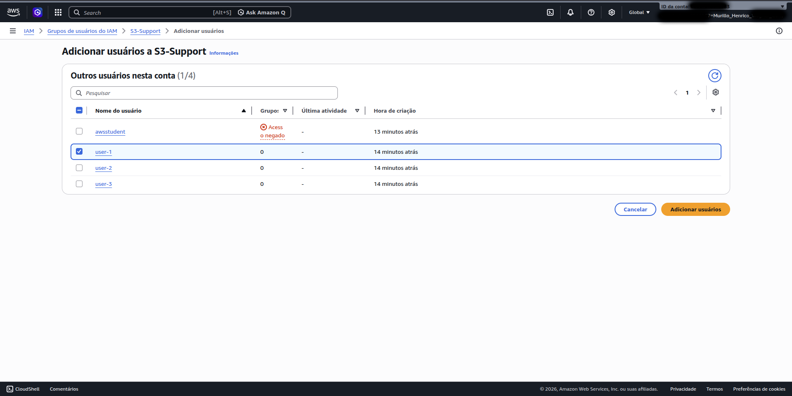
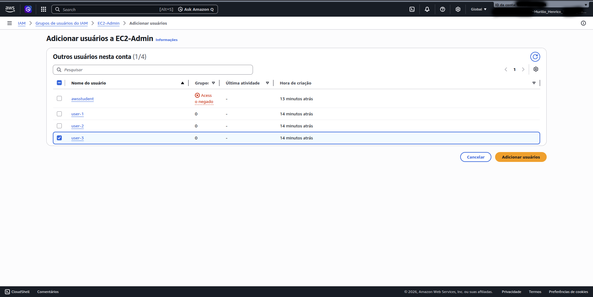
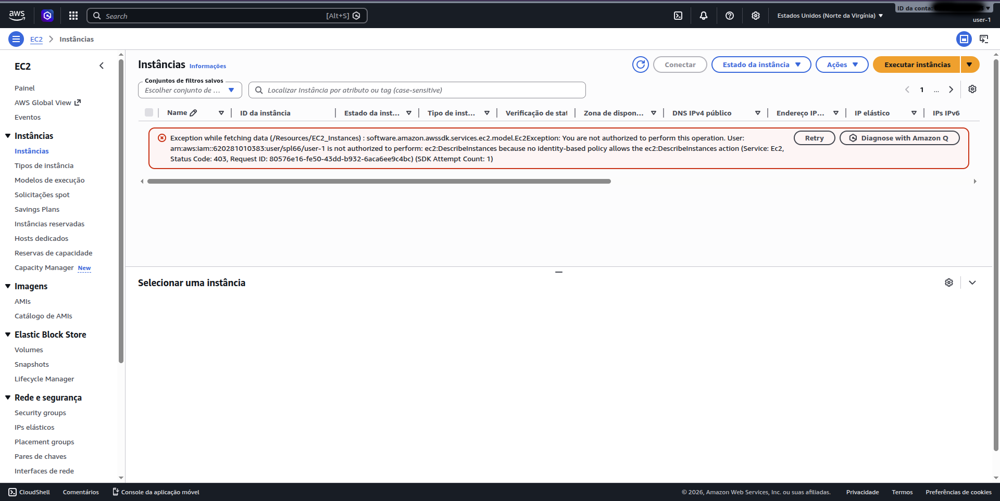
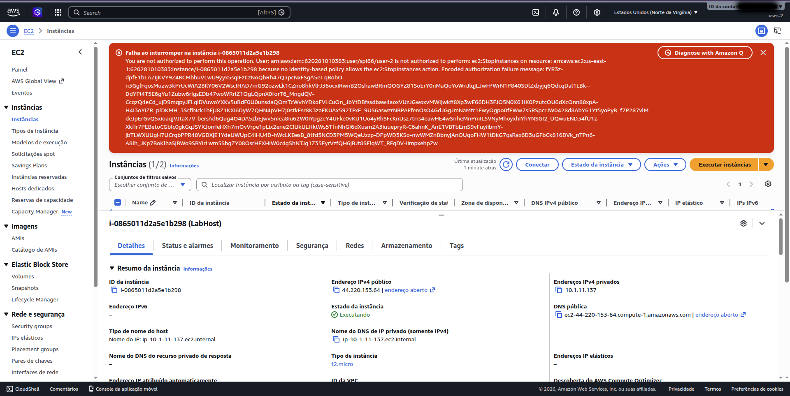
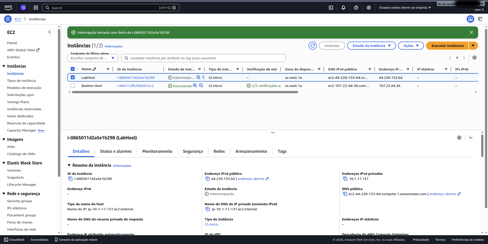

## Evidence

### IAM Groups Configuration
Demonstrating the IAM groups created for role separation:
- S3-Support
- EC2-Support
- EC2-Admin

---

### User Assignment – S3 Support
Adding `user-1` to the `S3-Support` group.

---

### User Assignment – EC2 Support
Adding `user-2` to the `EC2-Support` group.

---

### User Assignment – EC2 Admin
Adding `user-3` to the `EC2-Admin` group.

---

### Access Restriction Validation – user-1
`user-1` was unable to stop EC2 instances due to insufficient permissions.

---

### Access Restriction Validation – user-2
`user-2` had read-only EC2 permissions and could not stop instances.

---

### Administrative Access Validation – user-3
`user-3` successfully stopped the EC2 instance due to administrative permissions.

## Skills Demonstrated

- AWS IAM administration
- Role-Based Access Control (RBAC)
- IAM group management
- Managed and inline policies
- Permission validation
- EC2 access control
- S3 read-only access configuration
- Principle of Least Privilege

---

## Related Projects

- [AWS VPC + EC2(WebServer) Lab](https://github.com/murillohwg/aws-vpc-ec2-webserver-lab/tree/main)
