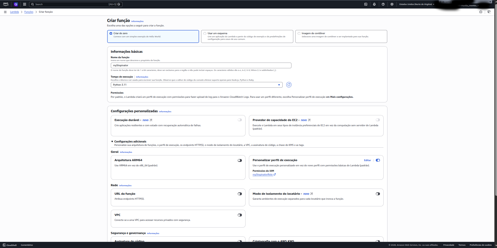
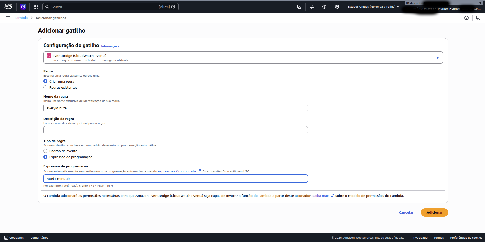
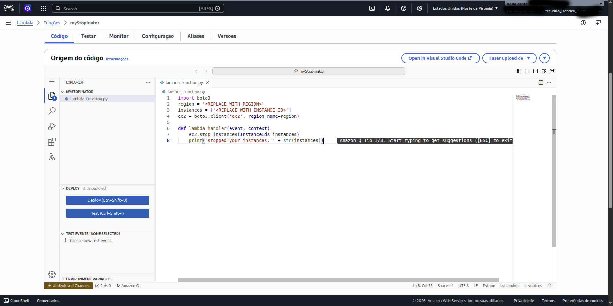
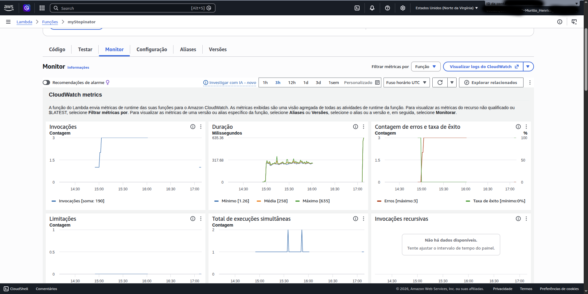
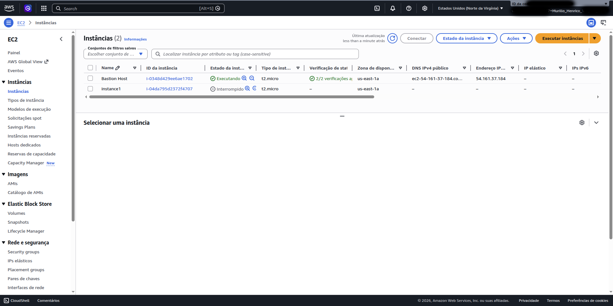

# AWS Lambda EC2 Stop Automation Lab


---

# Overview

This lab demonstrates how to automate Amazon EC2 instance management using:

- AWS Lambda
- Amazon EventBridge
- Python (Boto3)
- IAM Roles

The Lambda function automatically stops an EC2 instance every minute using a scheduled EventBridge trigger.

---

# Architecture

```text
EventBridge Trigger
        ↓
AWS Lambda Function
        ↓
Boto3 EC2 API
        ↓
Stop EC2 Instance
```

---

# Technologies Used

- AWS Lambda
- Amazon EC2
- Amazon EventBridge
- IAM Roles
- Python 3.11
- Boto3

---

# Task 1 — Create the Lambda Function

A Lambda function named `myStopinator` was created using Python 3.11 runtime.

The existing IAM role `myStopinatorRole` was attached to allow EC2 stop permissions.

## Screenshot



---

# Task 2 — Configure the EventBridge Trigger

An EventBridge scheduled trigger was created using:

```text
rate(1 minute)
```

This automatically invokes the Lambda function every minute.

## Screenshot



---

# Task 3 — Configure the Lambda Code

The Lambda function was configured using Python and Boto3.

## Lambda Code

```python
import boto3
region = 'us-east-1'
instances = ['INSTANCE_ID']
ec2 = boto3.client('ec2', region_name=region)

def lambda_handler(event, context):
    ec2.stop_instances(InstanceIds=instances)
    print('stopped your instances: ' + str(instances))
```

## Screenshot



---

# Task 4 — Monitor Lambda Executions

The Lambda monitoring dashboard was used to observe:

- invocations
- execution duration
- error rate
- success rate

## Screenshot



---

# Task 5 — Verify Automation

After the scheduled trigger executed, the EC2 instance `instance1` was automatically stopped.

This confirmed that:
- EventBridge successfully triggered Lambda
- Lambda successfully called the EC2 API
- the automation workflow functioned correctly

## Screenshot



---

# Skills Demonstrated

- Serverless automation
- AWS Lambda configuration
- Event-driven architecture
- EC2 automation
- IAM role usage
- Python cloud scripting
- EventBridge scheduling
- Infrastructure automation

---

# Real-World Use Cases

- Cost optimization
- Automatic shutdown of development environments
- Scheduled infrastructure management
- Cloud automation workflows
- Serverless operational tasks

---

# Troubleshooting

During testing, temporary AWS Academy credentials expired, causing authentication errors while accessing EC2 and CloudWatch resources.

Restarting the lab session resolved the issue.

---

# Final Notes

This lab demonstrated a practical serverless automation workflow using AWS Lambda and EventBridge to manage EC2 infrastructure automatically.
